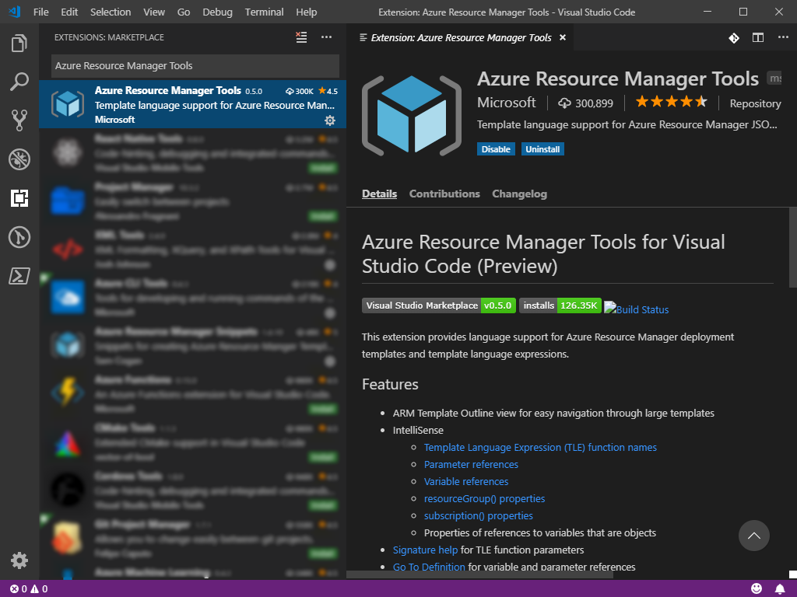
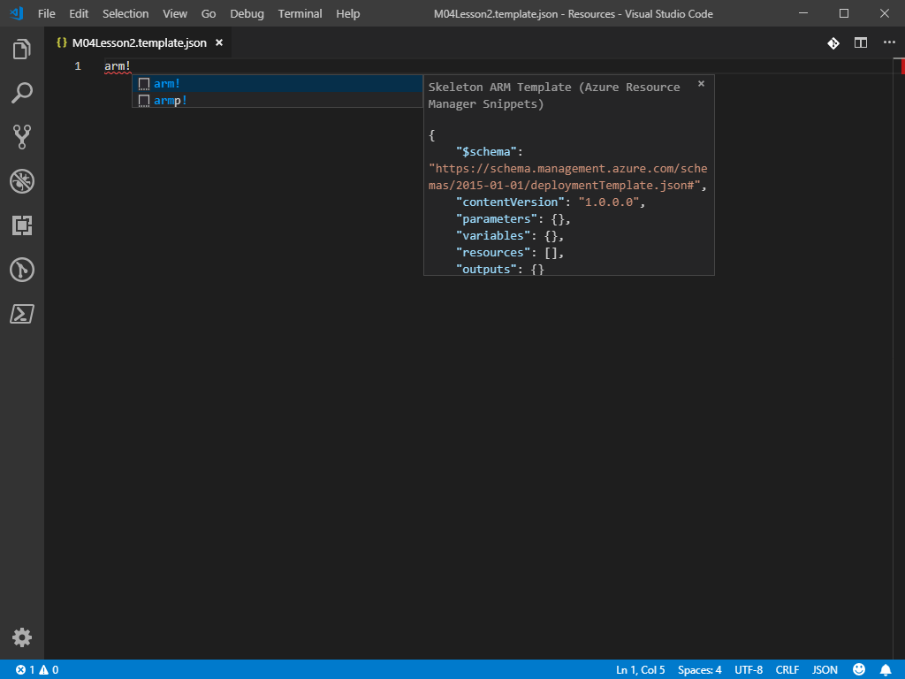
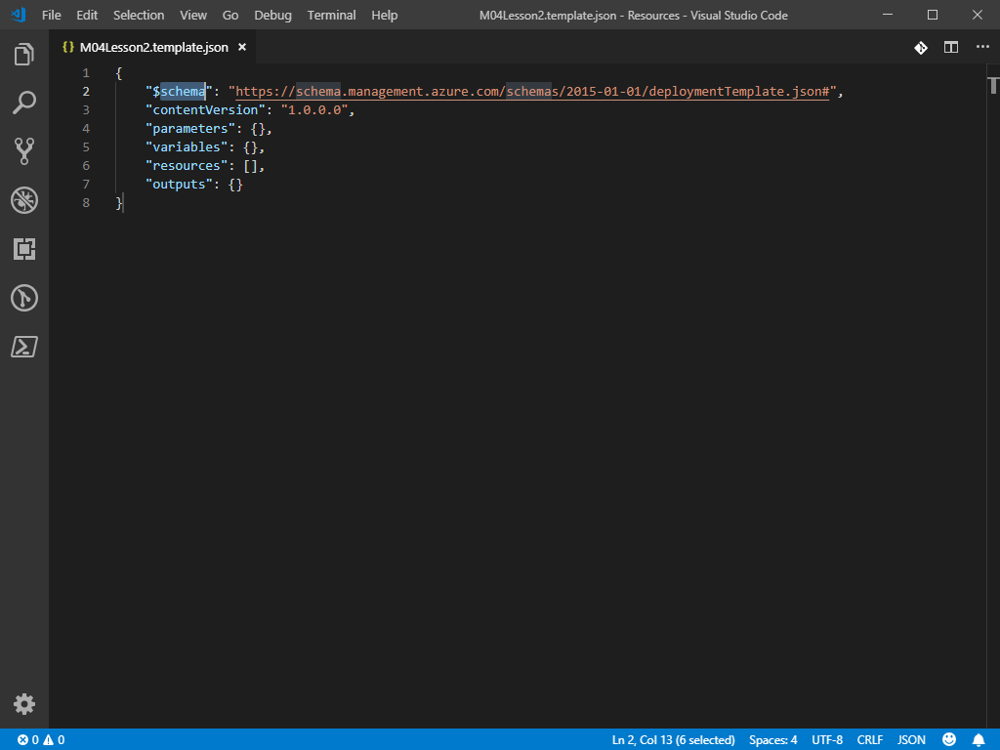
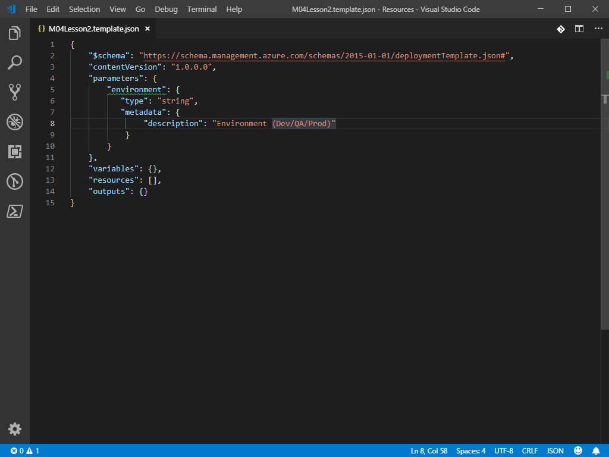
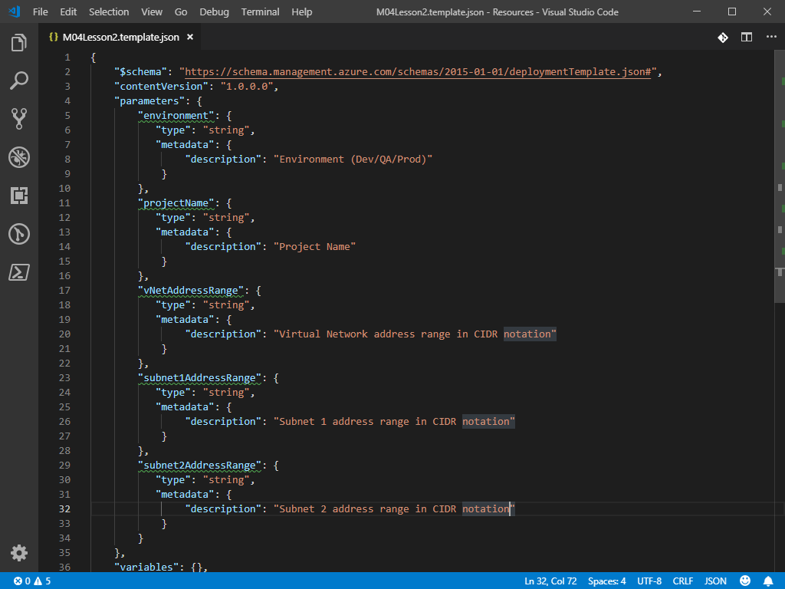
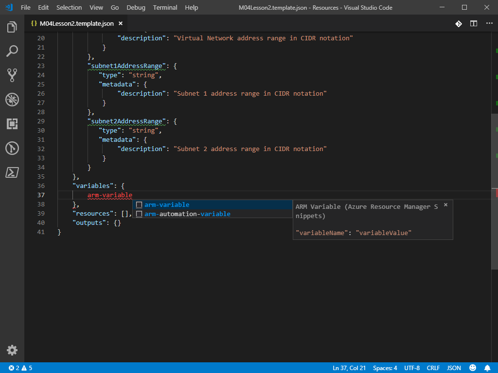
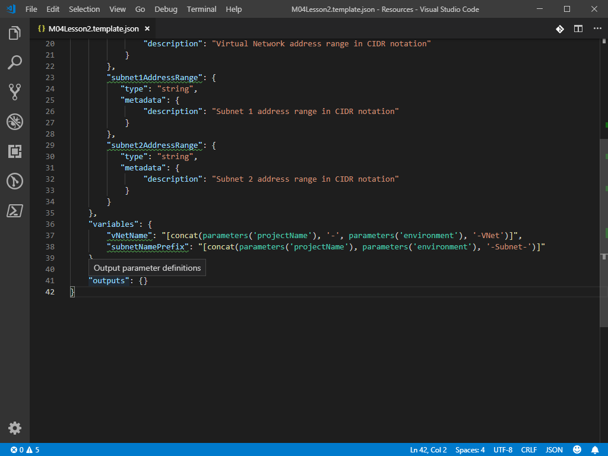
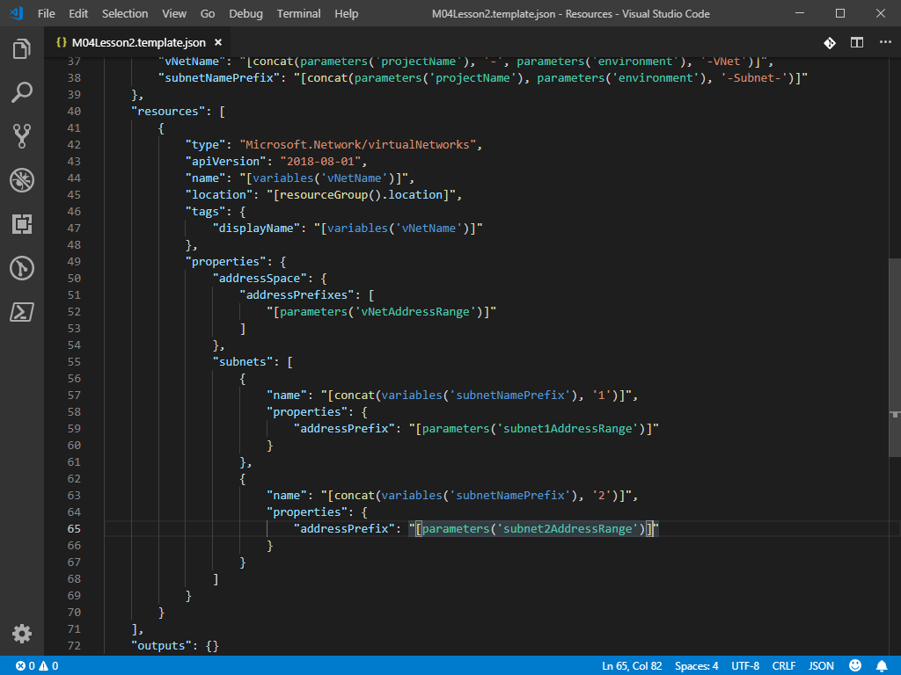
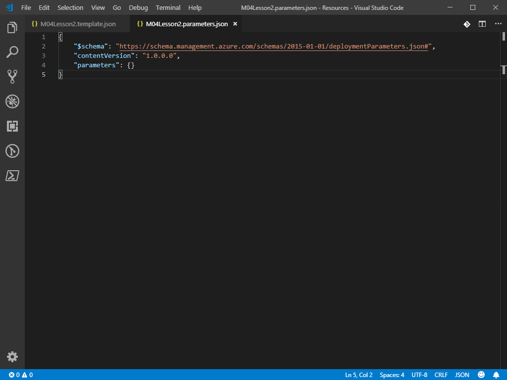
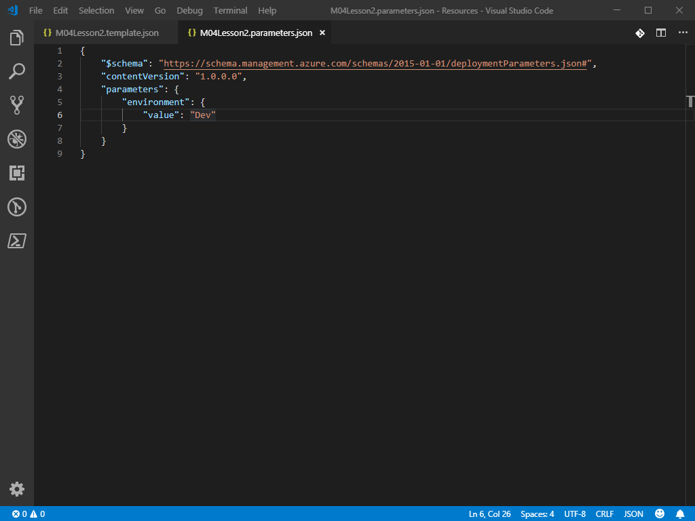

# Module 4 - Lesson 2

## Install Extensions
1. Launch Visual Studio Code
1. Open the Extensions view
   1. Windows/Linux: `Ctrl+Shift+X`
   1. macOS: `Shift+⌘+X`
1. If the [Azure Resource Manager Tools](https://marketplace.visualstudio.com/items?itemName=msazurermtools.azurerm-vscode-tools) extension is not installed, install it.

     

## Create a new ARM template file
1. Open `C:\Lab_Files\M04` in Visual Studio Code and create a subfolder named `S02`
1. Create a new file in `C:\Lab_Files\M04\S02` named `M04Lesson2.template.json` and open the file.
1. Type `arm!` and press `Enter` to insert the ARM template skeleton code snippet
     
     

     

1. **NOTE:** If IntelliSense does not popup or if hitting enter does not insert the block of code, you can trigger IntelliSense by pressing `Ctrl+Space` on Windows/Linux or `⌃+Space` on macOS

## Add parameters to the ARM template
1. Move your cursor in between the `{}` brackets on the line containing `"parameters": {},` and press `Enter` to create a new line
1. Type `arm-param` and press `Enter` to insert a new parameter snippet. (**NOTE:** Depending on the version of the snippet extension, the snippet may be referenced by another name such as `arm-parameter`)

1. Change `"parameter1"` to `"environment"`
1. Set the `"description"` value to `"Environment (Dev/QA/Prod)"`

     

1. Add four additional parameters with a description of your choice. (**NOTE:** you will need to add a `,` after the closing `}` for each parameter block except the final parameter)
   1. `"projectName"` -Description "Project Name"
   1. `"vNetAddressRange"` -Description "Virtual Network address range in CIDR notation"
   1. `"subnet1AddressRange"` -Description "Subnet 1 address range in CIDR notation"
   1. `"subnet2AddressRange"` -Description "Subnet 2 address range in CIDR notation"

     

## Add variables to the ARM template
1. Move your cursor in between the `{}` brackets on the line containing `"variables": {},` and press `Enter` to create a new line
1. Type `arm-variable` and press `Enter` to insert a new variable snippet

     

1. Change `"variable1"` to `"vNetName"`
1. Change `"value"` to `"[concat(parameters('projectName'), '-', parameters('environment'), '-VNet')]"`
   1. **NOTE:** Use IntelliSense to write this more efficiently
   1. Completely remove `"variableValue"` and start with a new `"`. Notice how Visual Studio Code automatically converts this to `""`
   1. Add a `[` and IntelliSense should present you with a list of functions. If it does not, you can trigger IntelliSense by pressing `Ctrl+Space` on Windows/Linux or `⌃+Space` on macOS
   1. Pick the `concat` function
   1. Now add the `parameters` function and notice how IntelliSense populates a list of available parameters
   1. Continue using IntelliSense to complete the variable value
1. Add a comma at the end of the line containing the vNetName variable, and then add another variable named `"subnetNamePrefix"` with a value of `"[concat(parameters('projectName'), parameters('environment'), '-Subnet-')]"`

     

## Add a Virtual Network resource to the ARM template
1. Move your cursor in between the `[]` brackets on the line containing `"resources": [],` and press `Enter` to create a new line
1. Type `arm-vnet` and press `Enter` to insert a new variable snippet. (**NOTE:** Depending on the version of the snippet extension, the snippet may be referenced by another name such as `arm-vn`)
1. Change the values of `"name"` and `"displayName"` from `"VirtualNetwork1"` to `"[variables('vNetName')]"`
1. Change the value of `"addressPrefixes"` under the `"addressSpace"` property from `"10.0.0.0/16"` to `"[parameters('vNetAddressRange')]"`
1. Change the value of `"name"` for the first subnet object from `"Subnet-1"` to `"[concat(variables('subnetNamePrefix'), '1')]"`
1. Change the value of `"addressPrefix"` for the first subnet object from `"10.0.0.0/24"` to `"[parameters('subnet1AddressRange')]"`
1. Update the second subnet object accordingly, changing the address prefix from 10.0.1.0/24 to `"[parameters('subnet2AddressRange')]"`
1. Once complete, save the file

     

## Create a new ARM parameters file
1. Create a new file named `M04Lesson2.parameters.json` and open the file.
1. Type `armp!` and press `Enter` to insert the ARM parameters skeleton code snippet

     

## Add parameters to the ARM parameters file
1. Move your cursor in between the `{}` brackets on the line containing `"parameters": {},` and press `Enter` to create a new line
1. Type `new-parameter-value` and press `Enter` to insert a new parameter value snippet. (**NOTE:** Depending on the version of the snippet extension, the snippet may be referenced by another name such as `arm-paramvalue` or `arm-param-value`)
1. Change `"parameter1"` to `"environment"`
1. Set `"value"` to `"Dev"`

     

1. Add the remaining parameters with the following values. Ensure you have commas at the end of each parameter block with the exception of the last one!
   1. `"projectName"` = `"M04Lesson2"`
   1. `"vNetAddressRange"` = `"10.0.0.0/16"`
   1. `"subnet1AddressRange"` = `"10.0.0.0/24"`
   1. `"subnet2AddressRange"` = `"10.0.1.0/24"`
1. Once complete, save the file

     

## Deploy the ARM template file with the parameters file
1. Open PowerShell in `C:\Lab_Files\M04\S02` (**NOTE:** Visual Studio Code has a built-in PowerShell terminal that can be used in place of a standalone terminal.)
1. Authenticate PowerShell to Azure by running `Connect-AzAccount` as +++@lab.CloudPortalCredential(1).Username+++ using +++@lab.CloudPortalCredential(1).Password+++ as the password. (**NOTE:** If using Visual Studio Code's built-in terminal, the authentication window may be hidden behind the Visual Studio Code window.)
1. Run the following PowerShell commands to deploy the template

```PowerShell
Set-AzContext -Subscription 'YOUR_SUBSCRIPTION_ID(FOUND IN RESOURCES TAB OF LAB GUIDE)'
New-AzResourceGroupDeployment -Name 'M04Lesson2' -ResourceGroupName 'RG_NAME_FOUND_IN_RESOURCES_TAB' -TemplateFile '.\M04Lesson2.template.json' -TemplateParameterFile '.\M04Lesson2.parameters.json' -Mode Incremental
```

## Inspect the deployed Virtual Network
1. Open the Azure Portal as +++@lab.CloudPortalCredential(1).Username+++ using +++@lab.CloudPortalCredential(1).Password+++ as the password.
1. Navigate to the resource group `@lab.CloudResourceGroup(1848).Name`
1. Open the `M04Lesson2-Dev-VNet` virtual network
1. Notice the virtual network name and tag changed from `"[concat(parameters('projectName'), '-', parameters('environment'), '-VNet')]"` to `M04Lesson2-Dev-VNet`
1. Review the other virtual network properties and see how the template functions changed after deployment
