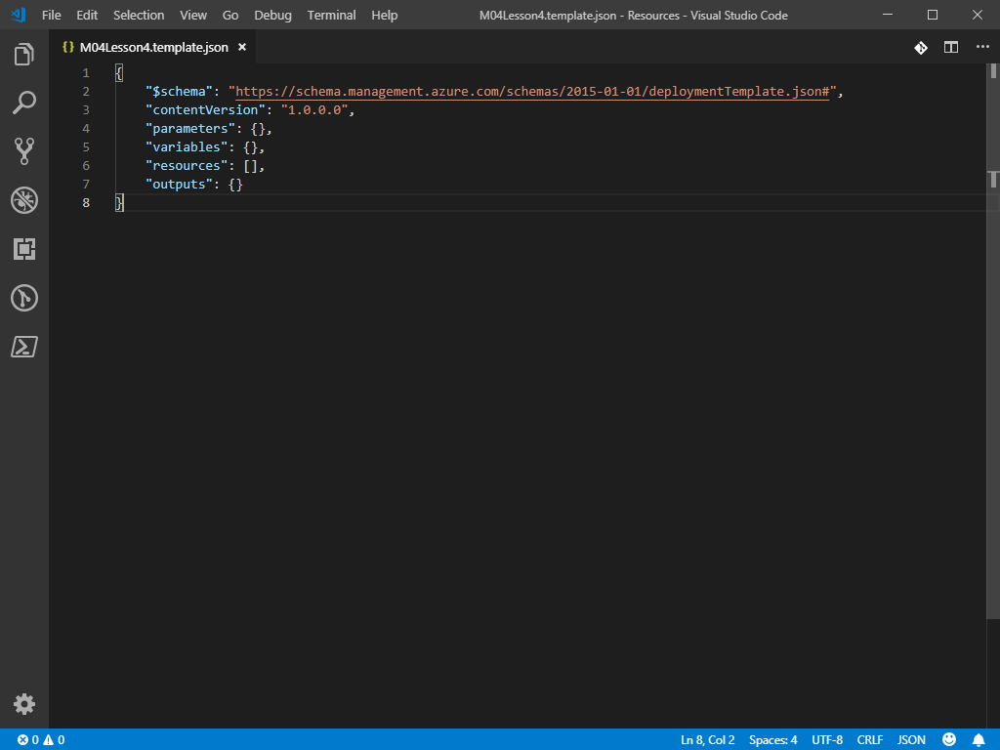
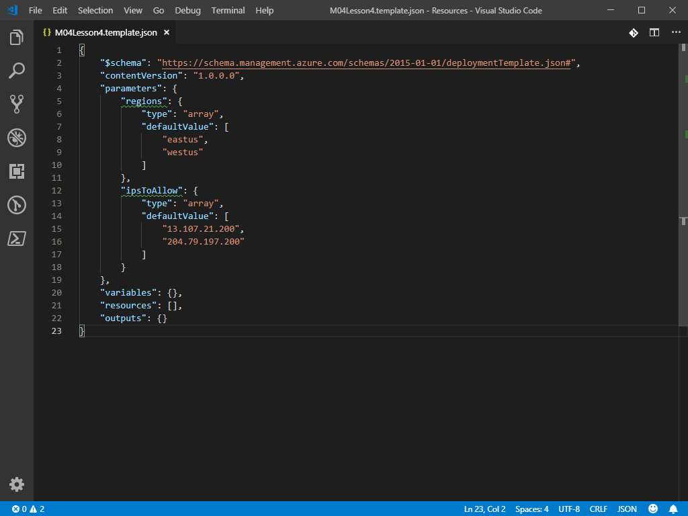
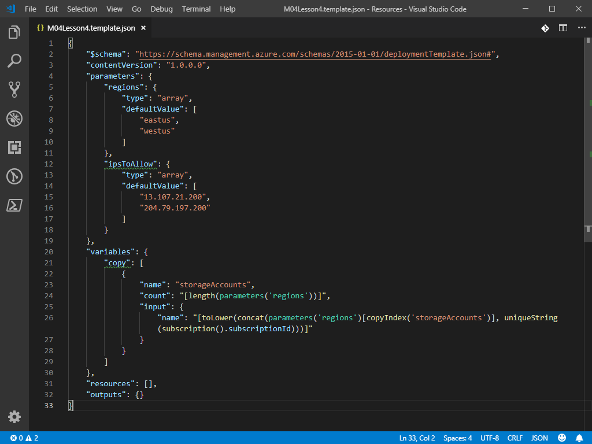
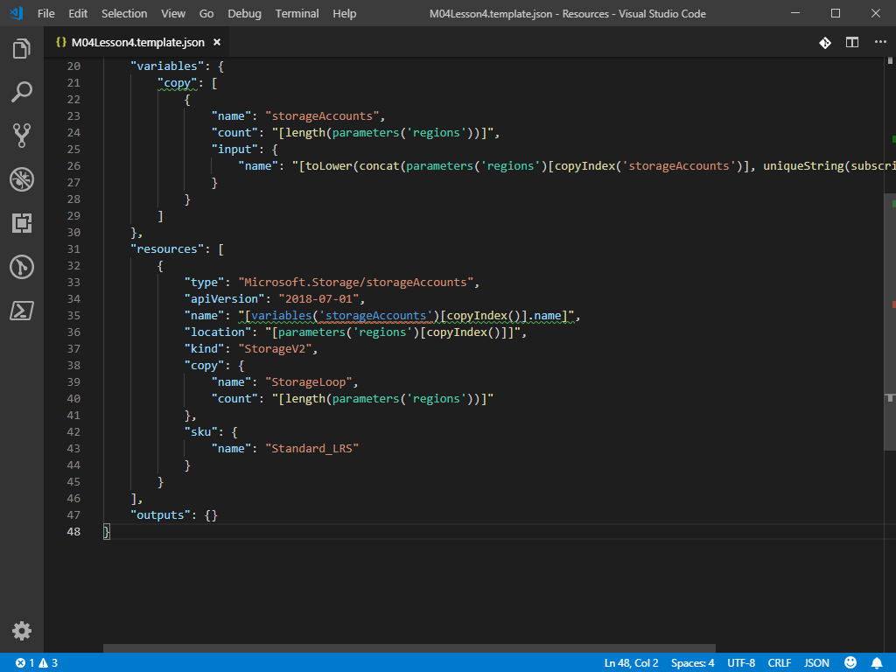
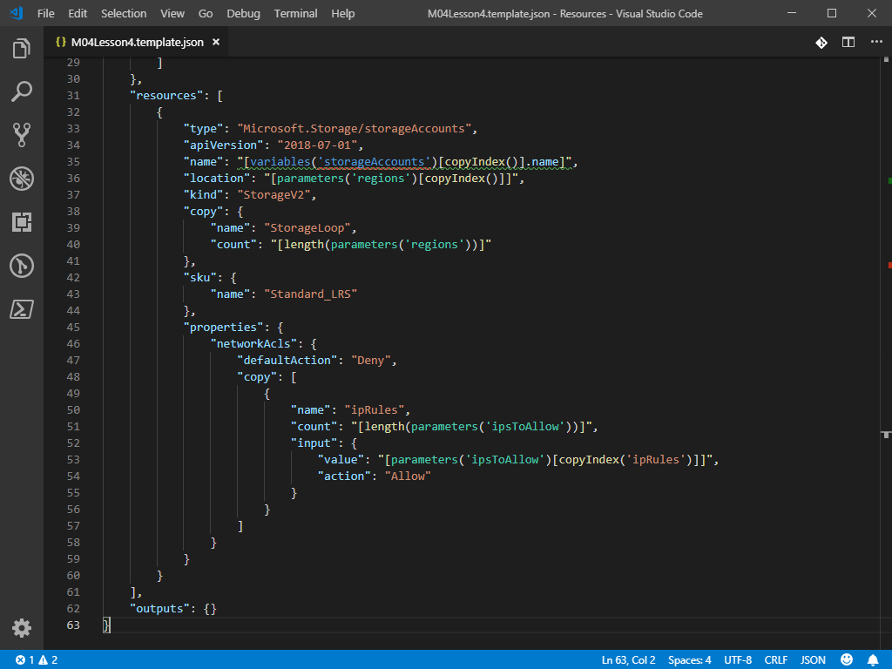
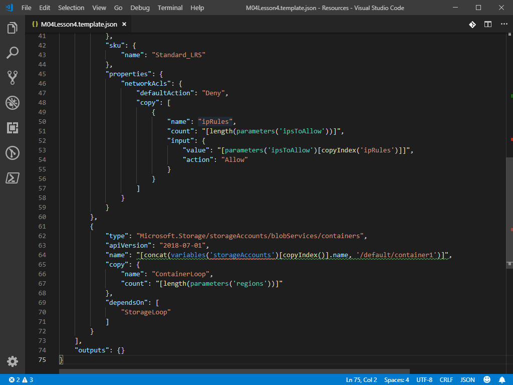

# Module 4 - Lesson 4
>[!ALERT]Please note that the lab environment is restricted by policy. You will be able to create only the Azure resources required by the lab.

## Create a new ARM template file
1. Open `C:\Lab_Files\M04` in Visual Studio Code and create a subfolder named `S04`
1. Create a new file in `C:\Lab_Files\M04\S04` named `M04Lesson4.template.json` and open the file.
1. Add the ARM template skeleton using the `arm!` code snippet
   
   

## Add parameters to the ARM template
1. Add the following parameters to the `"parameters": {}` section
   1. `regions`
      1. `"type": "array"`
      1. `"defaultValue": ["eastus", "westus"]`
      1. **NOTE:** These must be valid Azure regions and can be found with `Get-AzLocation` 
   1. `ipsToAllow`
      1. `"type": "array"`
      1. `"defaultValue": ["13.107.21.200", "204.79.197.200"]`
      1. **NOTE:** These entries must be public IP's. The default values above are resolved from bing.com
   
   

## Add a variable iteration copy loop to the ARM template
1. Add a variable iteration copy loop to the `"variables": {}` section
1. Move your cursor in between the `{}` brackets on the line containing `"variables": {},` and press `Enter` to create a new line
1. Type `"copy": []`. With your curser between the `[]`, press `Enter` to create a new line
1. Add a new object by typing `{}`. With your curser between the `{}`, press `Enter` to create a new line
1. Inside the `{}` object, add the following
   1. `"name": "storageAccounts"`
      1. This will be the name of the variable array created by the copy
   1. `"count": "[length(parameters('regions'))]"`
1. Below the `"count"` property, add an `"input": {}` object
1. Inside the `"input": {}` object, add the following
   1. `"name": "[toLower(concat(parameters('regions')[copyIndex('storageAccounts')], uniqueString(subscription().subscriptionId)))]"`
   
   

## Add a storage resource to the ARM template
1. Add a storage account resource to the `"resources": []` section. This will be done manually, without using a snippet
1. Move your cursor in between the `[]` brackets on the line containing `"resources": [],` and press `Enter` to create a new line
1. Add a new object by typing `{}`. With your curser between the `{}`, press `Enter` to create a new line
1. Inside the `{}` object, add the following
   1. `"type": "Microsoft.Storage/storageAccounts"`
   1. `"apiVersion": "2018-07-01"`
   1. `"name": "[variables('storageAccounts')[copyIndex()].name]"`
      1. **NOTE:** VS Code IntelliSense will throw errors on this value because it cannot verify the variable name from a variable iteration copy loop.
   1. `"location": "[parameters('regions')[copyIndex()]]"`
   1. `"kind": "StorageV2"`
1. Notice how the `name` and `location` properties are pulling values from an array using an index
1. Below the `location` property, add a resource iteration copy loop by typing `"copy": {}`. With your curser between the `{}`, press `Enter` to create a new line
1. Inside the `"copy": {}` object, add the following
   1. `"name": "StorageLoop"`
      1. **NOTE:** This name will be used for a dependency for another resource
   1. `"count": "[length(parameters('regions'))]"`
1. Below the `"copy": {}` object, add a `"sku": {}` object. With your curser between the `{}`, press `Enter` to create a new line
1. Inside the `"sku": {}` object, add the following
   1. `"name": "Standard_LRS"`
1. At this point, your resource should look as follows

    

1. Below the `"sku": {}` object, add a `"properties": {}` object. With your curser between the `{}`, press `Enter` to create a new line
1. Inside the `"properties": {}` object, add a `"networkAcls": {}` object. With your curser between the `{}`, press `Enter` to create a new line
1. Inside the `"networkAcls": {}` object, add the following
   1. `"defaultAction": "Deny"`
1. Below the `defaultAction` property, add a property iteration copy loop by typing `"copy": []`. With your curser between the `[]`, press `Enter` to create a new line
1. Add a new object by typing `{}`. With your curser between the `{}`, press `Enter` to create a new line
1. Inside the `{}` object, add the following
   1. `"name": "ipRules"`
   1. `"count": "[length(parameters('ipsToAllow'))]"`
1. Below the `"count"` property, add an `"input": {}` object
1. Inside the `"input": {}` object, add the following
   1. `"value": "[parameters('ipsToAllow')[copyIndex('ipRules')]]"`
   1. `"action": "Allow"`

    

## Add a blob container child resource to the ARM template
1. You will now add a blob container resource to the template. This is called a child resource, with the parent resource being the storage account.
1. Below the `Microsoft.Storage/storageAccounts` object, add a new object by typing `{}`. With your curser between the `{}`, press `Enter` to create a new line
1. Inside the `{}` object, add the following
   1. `"type": "Microsoft.Storage/storageAccounts/blobServices/containers"`
   1. `"apiVersion": "2018-07-01"`
   1. `"name": "[concat(variables('storageAccounts')[copyIndex()].name, '/default/container1')]"`
      1. Notice how the blob container name must reference the parent storage account resource
1. Below the `name` property, add a resource iteration copy loop by typing `"copy": {}`. With your curser between the `{}`, press `Enter` to create a new line
1. Inside the `"copy": {}` object, add the following
   1. `"name": "ContainerLoop"`
   1. `"count": "[length(parameters('regions'))]"`
1. Below the `"copy": {}` object, add a `"dependsOn": []` array. With your curser between the `[]`, press `Enter` to create a new line
1. Inside the `"dependsOn": []` array, add the following
   1. `"StorageLoop"`
      1. Notice how this reference the copy loop name from the storage account resource iteration instead of a named resource

    

## Deploy the ARM template file
1. Open PowerShell in `C:\Lab_Files\M04\S04`
1. Authenticate PowerShell to Azure by running `Connect-AzAccount` as +++@lab.CloudPortalCredential(1).Username+++ using +++@lab.CloudPortalCredential(1).Password+++ as the password.
1. Run the following PowerShell commands to deploy the template

  **NOTE:** Because both parameters have default values, you do not need to defined a parameter file. If you would like to override these values, please create a coordinating ARM parameter file. See the lab for Module 4 Lesson 2 for details on creating this file.

  ```PowerShell
  Set-AzContext -Subscription '@lab.CloudSubscription.Id'
  New-AzResourceGroupDeployment -Name 'M04Lesson4' -ResourceGroupName '@lab.CloudResourceGroup(1850).Name' -TemplateFile '.\M04Lesson4.template.json' -Mode Incremental
  ```

>[!TIP] If using a parameters file, use the command below

```PowerShell
New-AzResourceGroupDeployment -Name 'M04Lesson4' -ResourceGroupName '@lab.CloudResourceGroup(1850).Name' -TemplateFile '.\M04Lesson4.template.json' -TemplateParameterFile '.\M04Lesson4.parameters.json' -Mode Incremental
```

## Inspect the deployed Storage Account
1. Open the Azure Portal as +++@lab.CloudPortalCredential(1).Username+++ using +++@lab.CloudPortalCredential(1).Password+++ as the password.
1. Navigate to the resource group `@lab.CloudResourceGroup(1850).Name`
1. There should be one storage account per region defined in the `regions` parameter array
1. Open one of the storage accounts
1. Inside the `Firewalls and virtual networks` blade, there should be an entry for each public IP defined in the `ipsToAllow` parameter array
1. Inside the `Blobs` blade, there should be a container named container1
1. Review the other storage accounts deployed. Their properties should match with the exception of being deployed to a different region