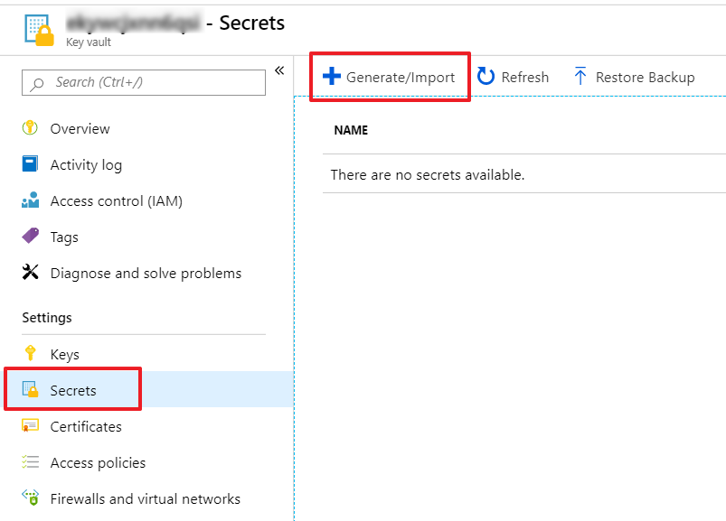

---
# This basic template provides core metadata fields for Markdown articles on docs.microsoft.com.

# Mandatory fields.
title: Lab - ARM Templates - Advanced Template Architecting
description: 115-145 characters including spaces. This abstract displays in the search result.
author: MPASCO
ms.author: MPASCO # Microsoft employees only
ms.date: 5/8/2019
ms.topic: AzureTemplate-Lab
# Use ms.service for services or ms.prod for on-prem products. Remove the # before the relevant field.
# ms.service: service-name-from-white-list
# ms.prod: product-name-from-white-list

# Optional fields. Don't forget to remove # if you need a field.
# ms.custom: can-be-multiple-comma-separated
# ms.reviewer: MSFT-alias-of-reviewer
# manager: MSFT-alias-of-manager-or-PM-counterpart
---
# Lab - ARM Templates - Advanced Template Architecting

>[!ALERT]Please note that the lab environment is restricted by policy. You will be able to create only the Azure resources required for the lab.

## Create VNet ARM template

### Create ARM template skeleton
1. Open `C:\Lab_Files\M04` in Visual Studio Code and create a subfolder named `S05`
1. Create a new file in `C:\Lab_Files\M04\S05` named `M04Lesson5.VNet.template.json` and open the file.
1. Type `arm!` and press `Enter` to insert the ARM template skeleton code snippet

```json
{
    "$schema": "https://schema.management.azure.com/schemas/2015-01-01/deploymentTemplate.json#",
    "contentVersion": "1.0.0.0",
    "parameters": {},
    "variables": {},
    "resources": [],
    "outputs": {}
}
```

### Add parameters and variables
1. Add the following parameters to the `"parameters": {},` section
   1. `"environment"`
   1. `"projectName"`
   1. `"vnetAddressPrefix"`
   1. `"subnetArray"`
      1. `"type": "array"`
    
    ```json
    "parameters": {
        "environment": {
            "type": "string",
            "metadata": {
                "description": "Environment (Dev/QA/Prod)"
            }
        },
        "projectName": {
            "type": "string",
            "metadata": {
                "description": "Project Name"
            }
        },
        "vnetAddressPrefix": {
            "type": "string",
            "metadata": {
                "description": "Address prefix for VNet"
            }
        },
        "subnetArray": {
            "type": "array",
            "metadata": {
                "description": "Array of subnets"
            }
        },
    },
    ```

1. Add the following variables and values to the `"variables": {},` section
   1. `"vnetName": "[concat('VNet-', parameters('projectName'), '-', parameters('environment'))]"`

    ```json
    "variables": {
        "vnetName": "[concat('VNet-', parameters('projectName'), '-', parameters('environment'))]"
    },
    ```

### Add virtual network resource
1. Using the `arm-vnet` snippet, add a virtual network resource to the `"resources": [],` section. (**NOTE:** Depending on the version of the snippet extension, the snippet may be referenced by another name such as `arm-vn`)
1. Change the values of `"name"` and `"displayName"` from `"VirtualNetwork1"` to `"[variables('vNetName')]"`
1. Change the value of `"addressPrefixes"` from `"10.0.0.0/16"` to `"[parameters('vnetAddressPrefix')]"`
1. Delete the entire `"subnets"` property array
   
   ```json
   {
      "type": "Microsoft.Network/virtualNetworks",
      "apiVersion": "2018-08-01",
      "name": "[variables('vnetName')]",
      "location": "[resourceGroup().location]",
      "tags": {
          "displayName": "[variables('vnetName')]"
      },
      "properties": {
          "addressSpace": {
              "addressPrefixes": [
                  "[parameters('vnetAddressPrefix')]"
              ]
          }
      }
   }
   ```

1. Below the `"addressSpace`", add a property iteration "copy": [] array block using the `"subnetAddressPrefixes"` property
   
   ```json
   "copy": [   
       {
           "name": "subnets",
           "count": "[length(parameters('subnetArray'))]",
           "input": {
               "name": "[concat('Subnet-', parameters('subnetArray')[copyIndex('subnets')].name)]",
               "properties": {
                   "addressPrefix": "[parameters('subnetArray')[copyIndex('subnets')].addressPrefix]"
               }
           }
       }
   ]
   ```

### Review completed VNet ARM template
The completed VNet ARM template should look as follows:
   
```json
{
    "$schema": "https://schema.management.azure.com/schemas/2015-01-01/deploymentTemplate.json#",
    "contentVersion": "1.0.0.0",
    "parameters": {
        "environment": {
            "type": "string",
            "metadata": {
                "description": "Environment (Dev/QA/Prod)"
            }
        },
        "projectName": {
            "type": "string",
            "metadata": {
                "description": "Project Name"
            }
        },
        "vnetAddressPrefix": {
            "type": "string",
            "metadata": {
                "description": "Address prefix for VNet"
            }
        },
        "subnetArray": {
            "type": "array",
            "metadata": {
                "description": "Array of subnets"
            }
        }
    },
    "variables": {
        "vnetName": "[concat('VNet-', parameters('projectName'), '-', parameters('environment'))]"
    },
    "resources": [
        {
            "type": "Microsoft.Network/virtualNetworks",
            "apiVersion": "2018-08-01",
            "name": "[variables('vnetName')]",
            "location": "[resourceGroup().location]",
            "tags": {
                "displayName": "[variables('vnetName')]"
            },
            "properties": {
                "addressSpace": {
                    "addressPrefixes": [
                        "[parameters('vnetAddressPrefix')]"
                    ]
                },
                "copy": [
                    {
                        "name": "subnets",
                        "count": "[length(parameters('subnetArray'))]",
                        "input": {
                            "name": "[concat('Subnet-', parameters('subnetArray')[copyIndex('subnets')].name)]",
                            "properties": {
                                "addressPrefix": "[parameters('subnetArray')[copyIndex('subnets')].addressPrefix]"
                            }
                        }
                    }
                ]
            }
        }
    ],
    "outputs": {}
}
```

## Deploy VNet template file & parameter file via PowerShell
### Create VNet parameter file
1. Create a new file named `M04Lesson5.VNet.parameters.json` and edit in Visual Studio Code
1. Type `armp!` and press `Enter` to insert the ARM parameters skeleton code snippet
1. Using the `arm-new-parameter-value` snippet, add the following parameters to the `"parameters": {},` section with values of your choice. (**NOTE:** Depending on the version of the snippet extension, the snippet may be referenced by another name such as `arm-paramvalue` or `arm-param-value`)
   1. `"environment"`
   1. `"projectName"`
   1. `"vnetAddressPrefix"`
1. Add an additional parameter called `"subnetArray"` but this will have a different value type because it is an array of objects. The schema must match what was used in the subnet copy loop and should look similar to the following, using values of your choice. The array must contain at least 1 subnet object.
   
   ```json
   "subnetArray": {
       "value": [
           {
               "name": "App",
               "addressPrefix": "10.0.1.0/24"
           },
           {
               "name": "Web",
               "addressPrefix": "10.0.2.0/24"
           }
       ]
   }
   ```

1. A sample completed ARM parameter file should look as follows:
   
   ```json
   {
       "$schema": "https://schema.management.azure.com/schemas/2015-01-01/deploymentParameters.json#",
       "contentVersion": "1.0.0.0",
       "parameters": {
           "environment": {
               "value": "Dev"
           },
           "projectName": {
               "value": "M04Lesson05"
           },
           "vnetAddressPrefix": {
               "value": "10.0.0.0/16"
           },
           "subnetArray": {
               "value": [
                   {
                       "name": "App",
                       "addressPrefix": "10.0.1.0/24"
                   },
                   {
                       "name": "Web",
                       "addressPrefix": "10.0.2.0/24"
                   }
               ]
           }
       }
   }
   ```

### Deploy VNet with PowerShell
1. Open PowerShell in `C:\Lab_Files\M04\S05`
1. Authenticate PowerShell to Azure by running az login, and then set-azcontext -subscriptionid “xx-xx-xx-xx”
1. Run the following PowerShell commands to deploy the template

```PowerShell
New-AzResourceGroupDeployment -Name 'M04Lesson5-VNet' -ResourceGroupName 'RG_NAME_LISTED_IN_RESOURCES'  -TemplateFile '.\M04Lesson5.VNet.template.json' -TemplateParameterFile  '.\M04Lesson5.VNet.parameters.json' -Mode Incremental
```

1. Open the Azure Portal using the provided credentials
1. Navigate to the resource group listed in your lab guide to see the newly created resources

## Create Key Vault ARM template
For the next step, we will be using a Key Vault to secure a SQL admin password used during deployment.
1. Create a new file named M04Lesson5.KeyVault.template.json and edit in Visual Studio Code
1. Create the ARM template skeleton
1. Add a paramater called `"userObjectId"` with a type of string
1. Add a varaible called `"keyVaultName"` and set the value as

   ```JSON
   "keyVaultName": "[uniqueString(subscription().subscriptionId)]"
   ```

1. Add the following Key Vault resource to the `"resources"` section

   ```JSON
   {
       "name": "[variables('keyVaultName')]",
       "type": "Microsoft.KeyVault/vaults",
       "apiVersion": "2018-02-14",
       "location": "[resourceGroup().location]",
       "properties": {
           "sku": {
               "family": "A",
               "name": "Standard"
           },
           "tenantId": "[subscription().tenantId]",
           "accessPolicies": [
               {
                   "tenantId": "[subscription().tenantId]",
                   "objectId": "[parameters('userObjectId')]",
                   "permissions": {
                       "secrets": [
                           "all"
                       ]
                   }
               }
           ],
           "enabledForTemplateDeployment": "true"
       }
   }
   ```

1. Add the following to the `"outputs"` section to return the resource ID of the Key Vault during deployment

   ```JSON
   "resourceID": {
       "type": "string",
       "value": "[resourceId('Microsoft.KeyVault/vaults', variables('keyVaultName'))]"
   }
   ```

### Review completed Key Vault ARM template
The completed Key Vault ARM template should look as follows:

```JSON
{
    "$schema": "https://schema.management.azure.com/schemas/2015-01-01/deploymentTemplate.json#",
    "contentVersion": "1.0.0.0",
    "parameters": {
        "userObjectId": {
            "type": "string"
        }
    },
    "variables": {
        "keyVaultName": "[uniqueString(subscription().subscriptionId)]"
    },
    "resources": [
        {
            "name": "[variables('keyVaultName')]",
            "type": "Microsoft.KeyVault/vaults",
            "apiVersion": "2018-02-14",
            "location": "[resourceGroup().location]",
            "properties": {
                "sku": {
                    "family": "A",
                    "name": "Standard"
                },
                "tenantId": "[subscription().tenantId]",
                "accessPolicies": [
                    {
                        "tenantId": "[subscription().tenantId]",
                        "objectId": "[parameters('userObjectId')]",
                        "permissions": {
                            "secrets": [
                                "all"
                            ]
                        }
                    }
                ],
                "enabledForTemplateDeployment": "true"
            }
        }
    ],
    "outputs": {
        "resourceID": {
            "type": "string",
            "value": "[resourceId('Microsoft.KeyVault/vaults', variables('keyVaultName'))]"
        }
    }
}
```

### Deploy Key Vault with PowerShell
1. Open PowerShell in `C:\Lab_Files\M04\S05`
1. Run the following PowerShell commands to deploy the template

```PowerShell
New-AzResourceGroupDeployment `
    -Name 'M04Lesson5-KeyVault' `
    -ResourceGroupName RG_NAME_IN_LAB_GUIDE  `
    -TemplateFile '.\M04Lesson5.KeyVault.template.json' `
    -Mode Incremental `
    -userObjectId (Get-AzADUser -UserPrincipalName ((Get-AzContext).Account.Id)).Id
```

1. Note that we are passing a parameter value inline to get the current user's Azure AD object ID, which is required to deploy a Key Vault.
1. After the deployment is complete, review the output section which will contain the Resource ID of the Key Vault. Record this ID because it will be needed later in this lab.

### Add secret to Key Vault
1. Login to the Azure Portal [https://portal.azure.com](https://portal.azure.com)
1. Navigate to the resource group and open the newly created Key Vault
1. Select Secrets from the navigation pane and click Generate/Import
   
   

1. Set `Name` to `SQLAdminPassword`
1. Set `Value` to `mySuperSecretPassword@123`
1. Keep all other settings at their default and click Create

## Deploy Azure SQL referencing VNet resource ID and Key Vault Secret
### Create Azure SQL ARM template
1. Create a new file named M04Lesson5.SQL.template.json and edit in Visual Studio Code
1. Create the ARM template skeleton
1. Add the following string parameters to the `"parameters": {},` section
   1. `"sqlAdminUsername"`
   1. `"sqlAdminPassword"`
      1. `type` should equal `securestring`
   1. `"vnetName"`
   1. `"subnetName"`

   ```JSON
   "parameters": {
       "sqlAdminUsername": {
           "type": "string"
       },
       "sqlAdminPassword": {
           "type": "securestring"
       },
       "vnetName": {
           "type": "string"
       },
       "subnetName": {
           "type": "string"
       }
   },
   ```

1. Add a variable named `"sqlServerName"` with a value of `"[concat('sql-', uniqueString(subscription().subscriptionId))]"`
1. Add another variable named `"vnetResourceId"`. The Azure SQL server will need to reference the full VNet's resource ID which can be retrieved using the `resourceId()` function referencing the `vnetName` parameter. The value should be `"[resourceId('Microsoft.Network/virtualNetworks', parameters('vnetName'))]"`
1. The completed `"variables": {},` should now look like

   ```JSON
   "variables": {
       "sqlServerName": "[concat('sql-', uniqueString(subscription().subscriptionId))]",
       "vnetResourceId": "[resourceId('Microsoft.Network/virtualNetworks', parameters('vnetName'))]"
   },
   ```

1. Under the `"resources": []` section, add a new resource object for an Azure SQL server with the following
   1. `"type": "Microsoft.Sql/servers"`
   1. `"name": "[variables('sqlServerName')]"`
   1. `"apiVersion": "2015-05-01-preview"`
   1. `"location": "[resourceGroup().location]"`
1. After the `"location"` property, add a section for `"properties":{}`
1. Inside of the new `"properties":{}` section, add the following properties
   1.  `"administratorLogin": "[parameters('sqlAdminUsername')]"`
   1.  `"administratorLoginPassword": "[parameters('sqlAdminPassword')]"`
1.  The `"resources": []` section hsould now look like

   ```JSON
   "resources": [
       {
           "type": "Microsoft.Sql/servers",
           "name": "[variables('sqlServerName')]",
           "apiVersion": "2015-05-01-preview",
           "location": "[resourceGroup().location]",
           "properties": {
               "administratorLogin": "[parameters('sqlAdminUsername')]",
               "administratorLoginPassword": "[parameters('sqlAdminPassword')]"
           }
       }
   ],
   ```
1. Under the `"resources": []` section, add another resource object for an Azure SQL server VNet rule with the following
   1. `"type": "Microsoft.Sql/servers/virtualNetworkRules"`
   1. `"name": "[concat(variables('sqlServerName'), '/VNetRule')]"`
   1. `"apiVersion": "2015-05-01-preview"`
   1. `"location": "[resourceGroup().location]"`
1. Notice that the type is a child resource type `virtualNetworkRules` under the parent resource type `Microsoft.Sql/servers`. The name must contain both the parent resource name as well as the child resource name.
1. Because it is a child resource, you must place a dependency for the parent resource. Add a `"dependsOn": []` array below the `location` value. The dependency should reference the `sqlServerName` variable as follows:

   ```JSON
   "dependsOn": [
       "[variables('sqlServerName')]"
   ],
   ```

1. After the `"dependsOn": []` array, add a section for `"properties":{}`
1. Inside of the new `"properties":{}` section, add the following properties
   1. `"virtualNetworkSubnetId": "[concat(variables('vnetResourceId'), '/subnets/', parameters('subnetName'))]"`
      1. Notice how you are combining the VNet resource ID generated earlier in the variables section with the subnet resource type and name
   1. `"ignoreMissingVnetServiceEndpoint": true`

### Review completed Azure SQL ARM template
The completed Azure SQL ARM template should look as follows:

```JSON
{
    "$schema": "https://schema.management.azure.com/schemas/2015-01-01/deploymentTemplate.json#",
    "contentVersion": "1.0.0.0",
    "parameters": {
        "sqlAdminUsername": {
            "type": "string"
        },
        "sqlAdminPassword": {
            "type": "securestring"
        },
        "vnetName": {
            "type": "string"
        },
        "subnetName": {
            "type": "string"
        }
    },
    "variables": {
        "sqlServerName": "[concat('sql-', uniqueString(subscription().subscriptionId))]",
        "vnetResourceId": "[resourceId('Microsoft.Network/virtualNetworks', parameters('vnetName'))]"
    },
    "resources": [
        {
            "type": "Microsoft.Sql/servers",
            "name": "[variables('sqlServerName')]",
            "apiVersion": "2015-05-01-preview",
            "location": "[resourceGroup().location]",
            "properties": {
                "administratorLogin": "[parameters('sqlAdminUsername')]",
                "administratorLoginPassword": "[parameters('sqlAdminPassword')]"
            }
        },
        {
            "type": "Microsoft.Sql/servers/virtualNetworkRules",
            "name": "[concat(variables('sqlServerName'), '/VNetRule')]",
            "apiVersion": "2015-05-01-preview",
            "location": "[resourceGroup().location]",
            "dependsOn": [
                "[variables('sqlServerName')]"
            ],
            "properties": {
                "virtualNetworkSubnetId": "[concat(variables('vnetResourceId'), '/subnets/', parameters('subnetName'))]",
                "ignoreMissingVnetServiceEndpoint": true
            }
        }
    ],
    "outputs": {}
}
```

## Deploy Azure SQL template file & parameter file via PowerShell
### Create Azure SQL parameter file
1. Create a new file named `M04Lesson5.SQL.parameters.json` and edit in Visual Studio Code
1. Type `armp!` and press `Enter` to insert the ARM parameters skeleton code snippet
1. Add the following parameters to the `"parameters": {},` section
   1. `"sqlAdminUsername"` with a value of `"sqladmin"`
   1. `"vnetName"` with a value set to the name of the VNet deployed earlier in the lesson
   1. `"subnetName"` with a value set to the name of a subnet deployed earlier in the lesson
1. The final parameter is `sqlAdminPassword` but it will not use a standard string value. Instead, it will reference the Key Vault build earlier in the lesson. For this, you will need the Key Vault resource ID returned from the last deployment. If you do not have the resource ID, browse to the Key Vault in the Azure Portal, select Properties from the navigation pane and you will find the Resource ID. You will also need the name of the secret created, which should be `SQLAdminPassword` if the recommended name was used.

   ```JSON
   "sqlAdminPassword": {
       "reference": {
           "keyVault": {
               "id": "/subscriptions/@lab.CloudSubscription.Id/resourceGroups/@lab.CloudResourceGroup(1851).Name/providers/Microsoft.KeyVault/vaults/{KEY_VAULT_NAME}"
           },
           "secretName": "SQLAdminPassword"
       }
   }
   ```

1. The completed ARM parameter file should look as follows:

   ```JSON
   {
       "$schema": "https://schema.management.azure.com/schemas/2015-01-01/deploymentParameters.json#",
       "contentVersion": "1.0.0.0",
       "parameters": {
           "sqlAdminUsername": {
               "value": "sqladmin"
           },
           "vnetName": {
               "value": "YOUR_VNET_NAME"
           },
           "subnetName": {
               "value": "YOUR_SUBNET_NAME"
           },
           "sqlAdminPassword": {
               "reference": {
                   "keyVault": {
                       "id": "YOUR_KEY_VAULT_RESOURCE_ID"
                   },
                   "secretName": "SQLAdminPassword"
               }
           }
       }
   }
   ```

### Deploy Key Vault with PowerShell
1. Open PowerShell in `C:\Lab_Files\M04\S05`
1. Run the following PowerShell commands to deploy the template

   ```PowerShell
   New-AzResourceGroupDeployment -Name 'M04Lesson5-SQL' -ResourceGroupName 'RG_NAME_LISTED_IN_RESOURCES' -TemplateFile '.\M04Lesson5.SQL.template.json' -TemplateParameterFile '.\M04Lesson5.SQL.parameters.json' -Mode Incremental
   ```

1. Open the Azure Portal as the user listed in your lab guide
1. Navigate to the resource group listed in your lab guide
1. Click `Deployments` under the "Settings" section and open the `M04Lesson5-SQL` deployment
1. Open the `Inputs` section and notice how the `sqlAdminPassword` is completely blank because of the `securestring` type
1. Open the Azure SQL instance and select the `Firewalls and virtual networks` section from the navigation pane and notice the Service Endpoint linked to the subnet
